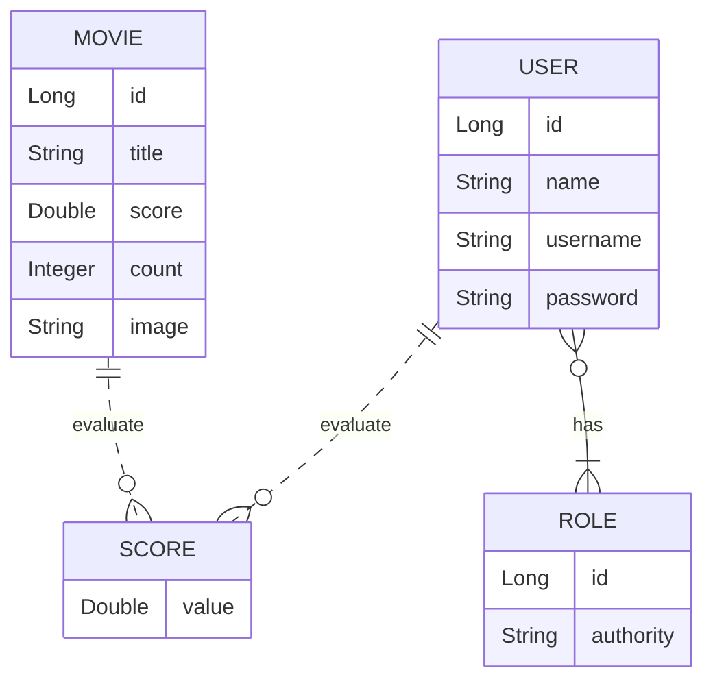

# CHALLENGE DS-MOVIE JACOCO
📅 January 03, 2024 - 📍 São Paulo, Brazil 

## Versões
- Java 21
- Maven 3.x
- Spring 3
- Jacoco 0.8.7

## Projeto
Este é um projeto de filmes e avaliações de filmes. A visualização dos dados dos filmes é pública (não necessita login), 
porém as alterações de filmes (inserir, atualizar, deletar) são permitidas apenas para usuários ADMIN. As avaliações de 
filmes podem ser registradas por qualquer usuário logado CLIENT ou ADMIN. A entidade Score armazena uma nota de 0 a 5 
(score) que cada usuário deu a cada filme. Sempre que um usuário registra uma nota, o sistema calcula a média das notas 
de todos usuários, e armazena essa nota média (score) na entidade Movie, juntamente com a contagem de votos (count).

## Entidades

## Testes Realizados

- MovieService
  - findAll() deve retornar uma página de filmes
  - findById(id) deve retornar um filme quando o id existir
  - findById(id) deve lançar ResourceNotFoundException quando o id não existir
  - insert(dto) deve retornar um filme
  - update(id, dto) deve retornar um filme quando o id existir
  - update(id, dto) deve lançar ResourceNotFoundException quando o id não existir
  - delete(id) deve fazer nada quando o id existir
  - delete(id) deve lançar ResourceNotFoundException quando o id não existir
  - delete(id) deve lançar DatabaseException quando o id for dependente

- UserService
  - authenticated() deve retornar um usuário quando houver usuário logado
  - authenticated() deve lançar UsernameNotFoundException quando não houver usuário logado
  - loadUserByUsername(username) deve retornar um UserDetails quando o username existir
  - loadUserByUsername(username) deve lançar UsernameNotFoundException quando o username não existir

- ScoreService
  - saveScore(dto) deve retornar os dados do filme quando o id existir
  - saveScore(dto) deve lançar ResourceNotFoundException quando o id do filme não existir
